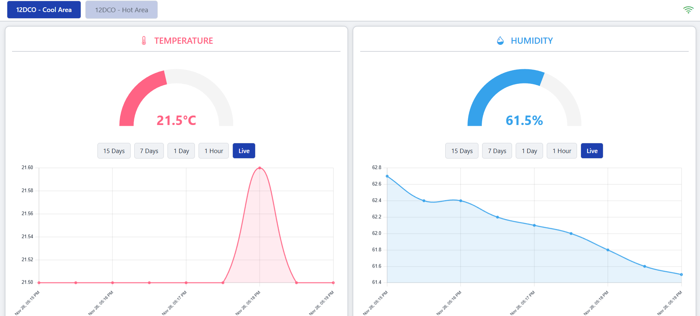

<div align="center">

# 🌡️ DHT Logger

**IoT Sensor Data Logger with Real-time Dashboard**

[](https://fastapi.tiangolo.com/) [](https://getbootstrap.com/) [](https://www.docker.com/) [](https://www.emqx.com/) [](https://github.com/whyuhurtz/DHT_Logger/releases)

</div>

---

## 📋 Overview



**DHT Logger** is an IoT application that collects temperature and humidity data from **ESP32 DHT22 sensors** via **MQTT protocol**, stores the data in a **MySQL database**, and displays it in a **real-time web dashboard** powered by **FastAPI** and **Bootstrap 5**.

> **Note:** The ESP32 device will send sensor data every **1/2 hour** to the MQTT broker (EMQX).

---

## 🗃️ Project Structure

```txt
DHT_Logger/
├── iot/                     # ESP32 Arduino code
│   ├── main.ino             # Main Arduino sketch
│   ├── secret.h             # WiFi & MQTT credentials
│   └── secret.example.h     # Example configuration
│
├── web/                     # FastAPI backend & frontend
│   ├── src/
│   │   ├── main.py          # FastAPI application
│   │   ├── mqtt.py          # MQTT client handler
│   │   ├── models.py        # Database models
│   │   ├── database.py      # MySQL connection pool
│   │   ├── config.py        # Environment configuration
│   │   ├── static/          # CSS & JavaScript
│   │   └── templates/       # HTML templates
│   │
│   ├── mysql-init/
│   │   └── 01-init.sql      # Database initialization
│   │
│   ├── docker-compose.yml   # Docker Compose config
│   ├── Dockerfile           # FastAPI container
│   ├── .env                 # Environment variables
│   └── requirements-prod.txt
│
├── setup.py                 # Automated setup script
└── README.md                # This file
```

---

##  🛠️️ Architecture

```txt
┌─────────────┐      MQTT (TLS)      ┌──────────────┐
│   ESP32     │ ──────────────────►  │  EMQX Cloud  │
│  + DHT22    │   (Publish Data)     │   Broker     │
└─────────────┘                      └──────┬───────┘
                                            │
                                            │ Subscribe
                                            ▼
                                      ┌──────────────┐
                                      │   FastAPI    │
                                      │   Backend    │
                                      └──────┬───────┘
                                             │
                        ┌────────────────────┼────────────────────┐
                        │                    │                    │
                        ▼                    ▼                    ▼
                 ┌─────────────┐     ┌─────────────┐     ┌─────────────┐
                 │    MySQL    │     │     SSE     │     │  REST API   │
                 │  Database   │     │  (Realtime) │     │ Endpoints   │
                 └─────────────┘     └─────────────┘     └─────────────┘
                                             │                    │
                                             └────────┬───────────┘
                                                      │
                                                      ▼
                                              ┌──────────────┐
                                              │ Web Dashboard│
                                              │ (Bootstrap)  │
                                              └──────────────┘
```

---

## 📝 Environment Variables Reference

| Variable | Description | Example |
|----------|-------------|---------|
| `APP_VERSION` | Application version | `0.0.1` |
| `MYSQL_HOST` | MySQL hostname | `mysql_dht` (Docker) / `localhost` (Manual) |
| `MYSQL_PORT` | MySQL port | `3306` |
| `MYSQL_USER` | Database username | `your_user` |
| `MYSQL_PASSWORD` | Database password | `your_password` |
| `MYSQL_DATABASE` | Database name | `dht_logger` |
| `MQTT_BROKER_URL` | MQTT broker hostname | `your-broker.emqxsl.com` |
| `MQTT_BROKER_PORT` | MQTT broker port (TLS) | `8883` |
| `MQTT_USERNAME` | MQTT username | `your_mqtt_user` |
| `MQTT_PASSWORD` | MQTT password | `your_mqtt_pass` |
| `MQTT_CA_CERT_FILE` | CA certificate path | `./emqxsl-ca.crt` |

---

## 🚀 Run Locally

### 1. Cloning this repo

```bash
git clone https://github.com/whyuhurtz/DHT_Logger.git
cd DHT_Logger/
```

### 2. Automated Deployment

I've created a file named `setup.py` (in the root project dir) to automate the deployment process. You can deploy manually with `--deploy manual`, which means it will *create python venv* → *activate venv* → *install requirements* → *run using `uvicorn`*. Or, if you have Docker installed, you can choose `--deploy docker` for easy deployment.

```bash
python setup.py --deploy manual  # Automate deployment with manual setup
python setup.py --deploy docker  # Automate deployment using Docker container
```

### 3. Cleanup Deployment

```bash
python setup.py --clean
```

---

<div align="center">

**⭐ Star this repository if you find it helpful!**

Made with 🔥 by [whyuhurtz](https://github.com/whyuhurtz)

</div>